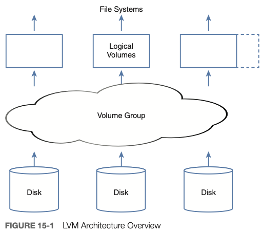
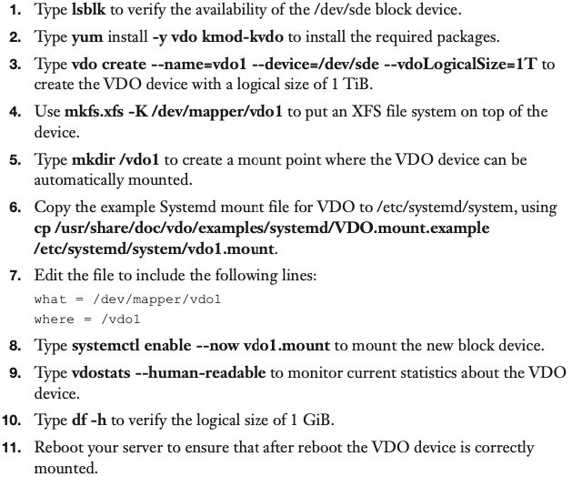

# Managing Advanced Storage

**Note: You do not need to memorize the commands discussed in this chapter for the RHCSA exam. All you really need to remember is `pv`, `vg` and `lv` and `--help`**

## Create Physical Volumes (PVs)

- Steps using `fdisk` and `gdisk`: 
    - create partition
    - change type using `t`, partition type is `8e`(MBR, msdos) or `8e00`(GUID, gpt)

- Steps using `parted`:
    - `parted /dev/<diskname>`
    - `mklabel <msdos/gpt>`
    - (`mkpart`)
    - choose `xfs`
    - start position `1MiB`
    - end position `1GiB`
    - `set <Number> lvm on`
**Note: When using parted, if there are partitions already created, you can skip `mklabel` and go straight for `mkpart`. Also in that case make sure to choose the correct starting point where the previous partition ends!**

- Actually flag created PV: `pvcreate /dev/<partitionname>`
  - Do check `pvs`

## Create Volume Groups (VGs)

**Note: In the case of adding a complete disk to a VG, there is no need to flag it as a PV.**

- Create VG with PV attached`vgcreate <vgname> /dev/<partitionname-or-diskname>`

- Specify the physical extent size: `vgcreate -s`

## Create Logical Volumes (LVs)

- Create LV: `lvcreate -n <lvname> -L <absolute-size> <vgname>`
  - using relative size: `-l <percentage-of-free-space>%FREE`
  - Creating file system on top of LV: `mkfs`

## LV Naming

- When logical volume is created it can be addressed in two of the following ways:
  - `/dev/<vgname>/<lvname>`
  - `/dev/mapper/<vgname>-<lvname>`

## Resizing LVM Logical Volumes

**Note:**
**- A volume with an XFS filesystem can only be increased in size!**
**- A volume with EXT4 can also be decreased. This has to happen offline (while unmounted) however.**

- Extend VG:
  - Make sure a PV (partition of type lvm that has become a physical volume) or device is available
  - Use `vgextend`

- Resize LV: `lvresize` or `lvextend`
  - `lvresize -L +1G -r /dev/<vgname>/<lvname>`     (Adds 1GiB)
  - `lvresize -r -l 75%VG /dev/<vgname>/<lvname>`   (Sets the size to 75% of **total VG size**)
  - `lvresize -r -l +75%VG /dev/<vgname>/<lvname>`  (Adds 75% of **total VG size**)
  - `lvresize -r -l +75%FREE /dev/vgdata/lvdata`    (Adds 75% of **free space of the VG**)
  - `lvresize -r -l 75%FREE /dev/vgdata/lvdata`     (Sets the size to 75% of **free space of the VG**)

## Managing Stratis Volumes

- Install Stratis package and activate & enable Stratis service
  - `yum install stratisd stratis-cli`
  - `systemctl enable --now stratisd`
- Create Stratis pool
  - `stratis pool create mypool /dev/sdd`
  - `stratis pool list`
- Create Filesystem on top of pool
  - `stratis fs create mypool stratis1`
  - `stratis fs list`
- Mount Stratis Volume
  - `mkdir /stratis1`
  - `blkid`
  - Add `UUID=xxx /stratis1 xfs defaults,x-systemd.requires=stratisd.service 0 0` to `/etc/fstab`
- Create Stratis snapshot
  - `stratis filesystem snapshot mypool stratis1 stratis1-snap`
  - `stratis filesystem list`
  - `mount /dev/stratis/mypool/stratis1-snap /mnt`

  ## Managing VDO Storage

  

