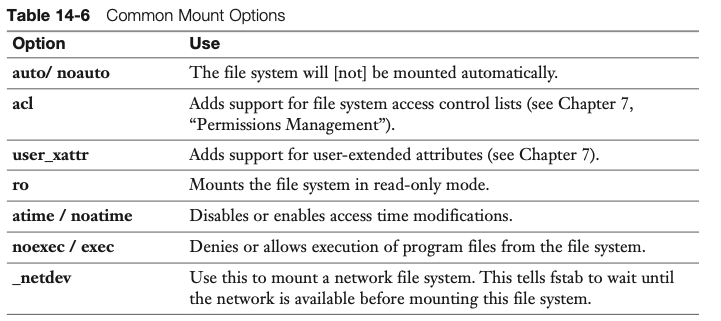

# Managing storage

- List blok storage: `lsblk`

## BACK UP
- Backup of first MB and fstab: 
    - `dd if=/dev/<your diskname> of=/root/diskfile bs=1M count=1`
    - `cp /etc/fstab /root/fstab`
- Restore backup: 
    - `dd if=/dev/diskfile of=/dev/<diskname>`
    - `cp /root/fstab /etc`

## PARTITIONING
**Note: When creating partiotions, don't forget to write at at the end using `w`!**

- Partitioning tool: `parted /dev/<your diskname>`
    - Print information about the device: `print`

- MBR partitions: `fdisk`
    - Write changes to kernel partition table: `partprobe /dev/sda`

- GPT partitions: `gdisk`

### SWAP
(if we are creating swapfile: `dd if=/dev/zero of=/ swapfile bs=1M count=100` and do actions on `/swapfile`)
- Create swap partition:
    - fdisk partition type: `82`
    - gdisk partition type: `8200`
    - `mkswap /dev/<diskname>`
    - `swapon /dev/<diskname>`
    - check if swap memory is created: `free -m`

## FILESYSTEM
- Creating a file system: 
    - XFS: `mkfs.xfs /dev/<diskname>`
    - Ext4: `tune2fs -l /dev/<diskname>` (Or just simply `mkfs.ext4 /dev/<diskname>`)
      - mount options: add `-o acl,user_xattr`, switch off `-o ^acl,user_xattr`
      - file system features: `-O`
      - set label: `-L` or `e2label`

## MOUNTING

- Mount and unmount file system: 
    - `mount /dev/xvda4 /mnt`
    - `umount /dev/xvda4` or `umount /mnt`
    - `mount UUID="42f419c4-633f-4ed7-b161-519a4dadd3da" /mnt`
    - `mount LABEL=mylabel /mnt`

- Find file system UUID's and types: `blkid`

- Automating File System Mounts: 
  - Modify `/etc/fstab`
  - Add line: `UUID="nnnn" /mounts/data xfs defaults 1 2`
  - Common mount options (use `,` to use multiple options): 
  
  - test, without actually rebooting `mount -a`
  - check if it works before and after reboot: `df -h`

